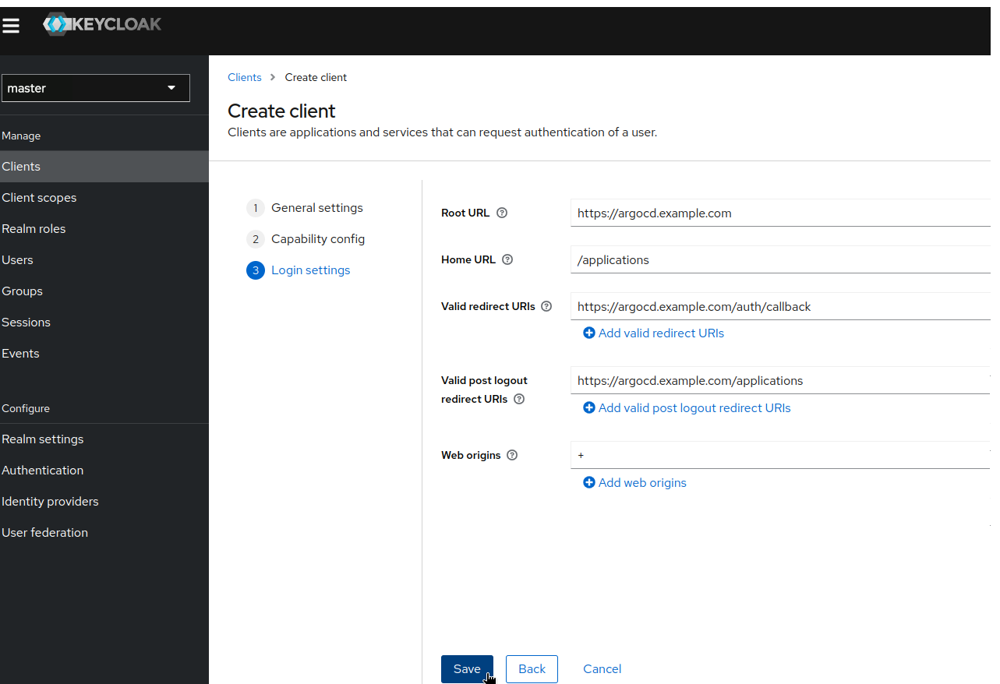
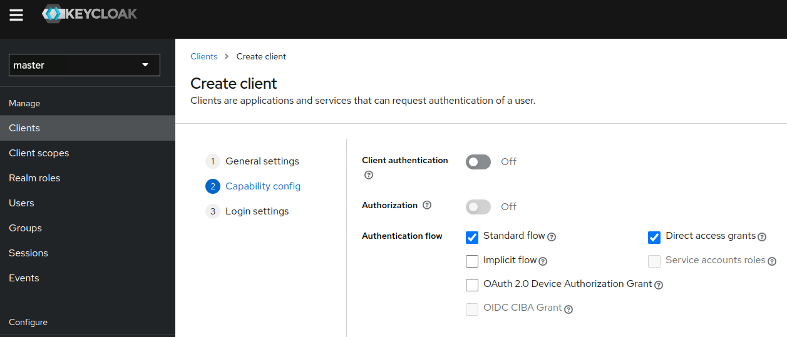
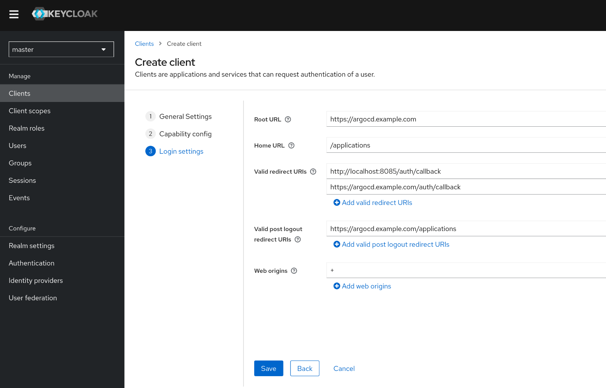
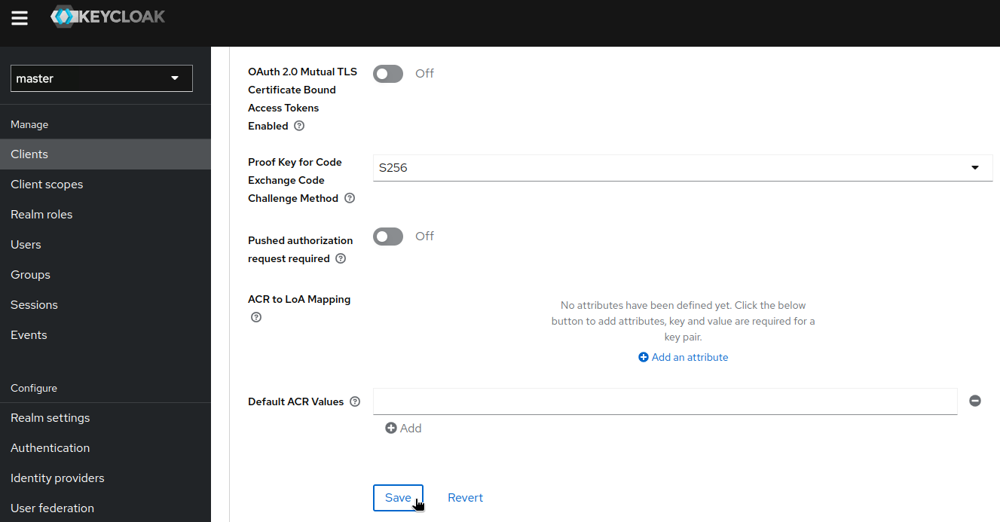
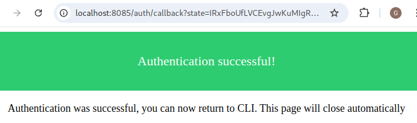

# Keycloak
Keycloak and Hanzo CD integration can be configured in two ways with Client authentication and with PKCE.

If you need to authenticate with __argo-cd command line__, you must choose PKCE way.

* [Keycloak and Hanzo CD with Client authentication](#keycloak-and-cd-with-client-authentication)
* [Keycloak and Hanzo CD with PKCE](#keycloak-and-cd-with-pkce)

## Keycloak and Hanzo CD with Client authentication

These instructions will take you through the entire process of getting your Hanzo CD application to authenticate with Keycloak.

Start by creating a client within Keycloak and configure Hanzo CD to use Keycloak for authentication, using groups set in Keycloak
to determine privileges in Argo.

### Creating a new client in Keycloak

First, setup a new client.

Start by logging into your keycloak server, select the realm you want to use (`master` by default)
and then go to __Clients__ and click the __Create client__ button at the top.


Enable the __Client authentication__.


Configure the client by setting the __Root URL__, __Web origins__, __Admin URL__ to the hostname (https://{hostname}).

Also you can set __Home URL__ to _/applications_ path and __Valid Post logout redirect URIs__ to "https://{hostname}/applications".

The __Valid Redirect URIs__ should be set to https://{hostname}/auth/callback (you can also set the less secure https://{hostname}/* for testing/development purposes,
but it's not recommended in production).



Make sure to click __Save__.

There should be a tab called __Credentials__. You can copy the Client Secret that we'll use in our Hanzo CD configuration.


### Configuring Hanzo CD OIDC

Let's start by storing the client secret you generated earlier in the cd secret _cd-secret_.

You can patch it with value copied previously:
```bash
kubectl -n argo-cd patch secret cd-secret --patch='{"stringData": { "oidc.keycloak.clientSecret": "<REPLACE_WITH_CLIENT_SECRET>" }}'
```

Now we can configure the config map and add the oidc configuration to enable our keycloak authentication.
You can use `$ kubectl edit configmap cd-cm`.

Your ConfigMap should look like this:

```yaml
apiVersion: v1
kind: ConfigMap
metadata:
  name: cd-cm
data:
  url: https://cd.example.com
  oidc.config: |
    name: Keycloak
    issuer: https://keycloak.example.com/realms/master
    clientID: cd
    clientSecret: $oidc.keycloak.clientSecret
    refreshTokenThreshold: 2m
    requestedScopes: ["openid", "profile", "email", "groups", "offline_access"]
```

Make sure that:

- __issuer__ ends with the correct realm (in this example _master_)
- __issuer__ on Keycloak releases older than version 17 the URL must include /auth (in this example /auth/realms/master)
- __clientID__ is set to the Client ID you configured in Keycloak
- __clientSecret__ points to the right key you created in the _cd-secret_ Secret
- __requestedScopes__ contains the _groups_ claim if you didn't add it to the Default scopes
- __refreshTokenThreshold__ is less than the client token lifetime.  If this setting is not less than the token lifetime, a new token will be obtained for every request.  Keycloak sets the client token lifetime to 5 minutes by default.

## Keycloak and Hanzo CD with PKCE

These instructions will take you through the entire process of getting your Hanzo CD application authenticating with Keycloak.

You will create a client within Keycloak and configure Hanzo CD to use Keycloak for authentication, using groups set in Keycloak
to determine privileges in Argo.

You will also be able to authenticate using Hanzo CD command line.

### Creating a new client in Keycloak

First, setup a new client.

Start by logging into your keycloak server, select the realm you want to use (`master` by default)
and then go to __Clients__ and click the __Create client__ button at the top.


Leave default values.



Configure the client by setting the __Root URL__, __Web origins__, __Admin URL__ to the hostname (https://{hostname}).

Also you can set __Home URL__ to _/applications_ path and __Valid Post logout redirect URIs__ to "https://{hostname}/applications".

The __Valid Redirect URIs__ should be set to:

- http://localhost:8085/auth/callback (needed for Hanzo CD cli, depends on value from [--sso-port](../../user-guide/commands/cd_login.md))
- https://{hostname}/auth/callback
- https://{hostname}/pkce/verify (needed for Hanzo CD UI)



Make sure to click __Save__.

Now go to the first tab called __Settings__, look for parameter named __PKCE Method__ in __Capability config__ and set it to __S256__.

For older Keycloak versions: Go to a tab called __Advanced__, look for parameter named __Proof Key for Code Exchange Code Challenge Method__ and set it to __S256__.


Make sure to click __Save__.

### Configuring Hanzo CD OIDC
Now we can configure the config map and add the oidc configuration to enable our keycloak authentication.
You can use `$ kubectl edit configmap cd-cm`.

Your ConfigMap should look like this:

```yaml
apiVersion: v1
kind: ConfigMap
metadata:
  name: cd-cm
data:
  url: https://cd.example.com
  oidc.config: |
    name: Keycloak
    issuer: https://keycloak.example.com/realms/master
    clientID: cd
    enablePKCEAuthentication: true
    refreshTokenThreshold: 2m
    requestedScopes: ["openid", "profile", "email", "groups", "offline_access"]
```

Make sure that:

- __issuer__ ends with the correct realm (in this example _master_)
- __issuer__ on Keycloak releases older than version 17 the URL must include /auth (in this example /auth/realms/master)
- __clientID__ is set to the Client ID you configured in Keycloak
- __enablePKCEAuthentication__ must be set to true to enable correct Hanzo CD behaviour with PKCE
- __requestedScopes__ contains the _groups_ claim if you didn't add it to the Default scopes
- __refreshTokenThreshold__ is less than the client token lifetime.  If this setting is not less than the token lifetime, a new token will be obtained for every request.  Keycloak sets the client token lifetime to 5 minutes by default.

## Configuring the groups claim

In order for Hanzo CD to provide the groups the user is in we need to configure a groups claim that can be included in the authentication token.

To do this we'll start by creating a new __Client Scope__ called _groups_.


Once you've created the client scope you can now add a Token Mapper which will add the groups claim to the token when the client requests
the groups scope.

In the Tab "Mappers", click on "Configure a new mapper" and choose __Group Membership__.

Make sure to set the __Name__ as well as the __Token Claim Name__ to _groups_. Also disable the "Full group path".


We can now configure the client to provide the _groups_ scope.

Go back to the client we've created earlier and go to the Tab "Client Scopes".

Click on "Add client scope", choose the _groups_ scope and add it either to the __Default__ or to the __Optional__ Client Scope.

If you put it in the Optional
category you will need to make sure that Hanzo CD requests the scope in its OIDC configuration.
Since we will always want group information, I recommend
using the Default category.


Create a group called _Hanzo CDAdmins_ and have your current user join the group.


## Configuring Hanzo CD Policy

Now that we have an authentication that provides groups we want to apply a policy to these groups.
We can modify the _cd-rbac-cm_ ConfigMap using `$ kubectl edit configmap cd-rbac-cm`.

```yaml
apiVersion: v1
kind: ConfigMap
metadata:
  name: cd-rbac-cm
data:
  policy.csv: |
    g, Hanzo CDAdmins, role:admin
```

In this example we give the role _role:admin_ to all users in the group _Hanzo CDAdmins_.

## Login

You can now login using our new Keycloak OIDC authentication:


If you have used PKCE method, you can also authenticate using command line:
```bash
cd login cd.example.com --sso --grpc-web
```

cd cli will start to listen on localhost:8085 and open your web browser to allow you to authenticate with Keycloak.

Once done, you should see



## Troubleshoot
If Hanzo CD auth returns 401 or when the login attempt leads to the loop, then restart the cd-server pod.
```
kubectl rollout restart deployment cd-server -n cd
```

If you migrate from Client authentication to PKCE, you can have the following error `invalid_request: Missing parameter: code_challenge_method`.

It could be a redirect issue, try in private browsing or clean browser cookies.
