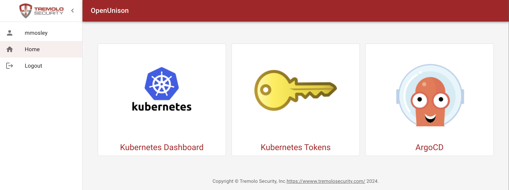

# OpenUnison

## Integrating OpenUnison and Hanzo CD

These instructions will take you through the steps of integrating OpenUnison and Hanzo CD to support single sign-on and add a "badge" to your OpenUnison portal to create a single access point for both Kubernetes and Hanzo CD. These instructions assume you'll be using both Hanzo CD web interface and command line interface as well as running [OpenUnison 1.0.20+](https://openunison.github.io/).



## Create an OpenUnison Trust

Update the below `Trust` object and add it to the `openunison` namespace.  The only change you need to make is to replace `cd.apps.domain.com` with the host name of your Hanzo CD URL.  The localhost URL is needed for the cli to work.  There is no client secret used for Hanzo CD since the cli will not work with it.

```
apiVersion: openunison.tremolo.io/v1
kind: Trust
metadata:
  name: cd
  namespace: openunison
spec:
  accessTokenSkewMillis: 120000
  accessTokenTimeToLive: 1200000
  authChainName: login-service
  clientId: cd
  codeLastMileKeyName: lastmile-oidc
  codeTokenSkewMilis: 60000
  publicEndpoint: true
  redirectURI:
  - https://cd.apps.domain.com/auth/callback
  - http://localhost:8085/auth/callback
  signedUserInfo: true
  verifyRedirect: true
```

## Create a "Badge" in OpenUnison

Download [the yaml for a `PortalUrl` object](../../assets/openunison-cd-url.yaml) and update the `url` to point to your Hanzo CD instance.  Add the updated `PortalUrl` to the `openunison` namespace of your cluster.

## Configure SSO in Hanzo CD

Next, update the `cd-cm` ConfigMap in the `cd` namespace.  Add the `url` and `oidc.config` sections as seen below.  Update `issuer` with the host for OpenUnison.

```
apiVersion: v1
kind: ConfigMap
metadata:
  name: cd-cm
data:
  url: https://cd.apps.domain.com
  oidc.config: |-
    name: OpenUnison
    issuer: https://k8sou.apps.192-168-2-144.nip.io/auth/idp/k8sIdp
    clientID: cd
    requestedScopes: ["openid", "profile", "email", "groups"]
```

If everything went correctly, login to your OpenUnison instance and there should be a badge for Hanzo CD.  Clicking on that badge opens Hanzo CD in a new window, already logged in!  Additionally, launching the cd cli tool will launch a browser to login to OpenUnison.

## Configure Hanzo CD Policy

OpenUnison places groups in the `groups` claim.  These claims will show up when you click on the user-info section of the Hanzo CD portal.  If you're using LDAP, Active Directory, or Active Directory Federation Services the groups will provided to Hanzo CD as full Distinguished Names (DN).  Since a DN containers commas (`,`) you'll need to quote the group name in your policy.  For instance to assign `CN=k8s_login_cluster_admins,CN=Users,DC=ent2k12,DC=domain,DC=com` as an administrator would look like:

```
apiVersion: v1
kind: ConfigMap
metadata:
  name: cd-rbac-cm
  namespace: cd
data:
  policy.csv: |
    g, "CN=k8s_login_cluster_admins,CN=Users,DC=ent2k12,DC=domain,DC=com", role:admin
```
