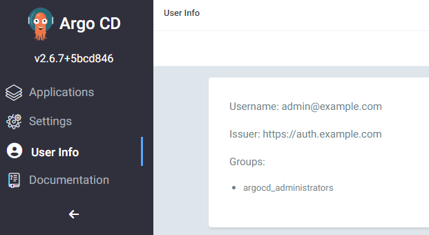

# Zitadel
Please also consult the [Zitadel Documentation](https://zitadel.com/docs).
## Integrating Zitadel and Hanzo CD
These instructions will take you through the entire process of getting your Hanzo CD application authenticating and authorizing with Zitadel. You will create an application within Zitadel and configure Hanzo CD to use Zitadel for authentication using roles set in Zitadel to determine privileges in Hanzo CD.

The following steps are required to integrate Hanzo CD with Zitadel:
1. Create a new project and a new application in Zitadel
2. Configure the application in Zitadel
3. Set up roles in Zitadel
4. Set up an action in Zitadel
5. Configure Hanzo CD configmaps
6. Test the setup

The following values will be used in this example:
- Zitadel FQDN: `auth.example.com`
- Zitadel Project: `cd-project`
- Zitadel Application: `cd-application`
- Zitadel Action: `groupsClaim`
- Hanzo CD FQDN: `cd.example.com`
- Hanzo CD Administrator Role: `cd_administrators`
- Hanzo CD User Role: `cd_users`

You may choose different values in your setup; these are used to keep the guide consistent.

## Setting up your project and application in Zitadel
First, we will create a new project within Zitadel. Go to **Projects** and select **Create New Project**.  
You should now see the following screen.  


Check the following options:
- Assert Roles on Authentication
- Check authorization on Authentication


### Roles

Go to **Roles** and click **New**. Create the following two roles. Use the specified values below for both fields **Key** and **Group**.
- `cd_administrators`
- `cd_users`

Your roles should now look like this:


### Authorizations

Next, go to **Authorizations** and assign your user the role `cd_administrators`.
Click **New**, enter the name of your user and click **Continue**. Select the role `cd_administrators` and click **Save**.

Your authorizations should now look like this:


### Creating an application

Go to **General** and create a new application. Name the application `cd-application`.

For type of the application, select **WEB** and click continue.


Select **CODE** and continue.


Next, we will set up the redirect and post-logout URIs. Set the following values:
- Redirect URI: `https://cd.example.com/auth/callback`
- Post Logout URI: `https://cd.example.com`

The post logout URI is optional. In the example setup users will be taken back to the Hanzo CD login page after logging out.


Verify your configuration on the next screen and click **Create** to create the application.


After clicking **Create** you will be shown the `ClientId` and the `ClientSecret` for your application. Make sure to copy the ClientSecret as you will not be able to retrieve it after closing this window.  
For our example, the following values are used:
- ClientId: `227060711795262483@cd-project`
- ClientSecret: `UGvTjXVFAQ8EkMv2x4GbPcrEwrJGWZ0sR2KbwHRNfYxeLsDurCiVEpa5bkgW0pl0`


Once you have saved the ClientSecret in a safe place, click **Close** to complete creating the application.

Go to **Token Settings** and enable the following options:  
- User roles inside ID Token
- User Info inside ID Token


## Setting up an action in Zitadel

To include the role of the user in the token issued by Zitadel, we will need to set up a Zitadel Action. The authorization in Hanzo CD will be determined by the role contained within the auth token.  
Go to **Actions**, click **New** and choose `groupsClaim` as the name of your action.

Paste the following code into the action:

```javascript
/**
 * sets the roles an additional claim in the token with roles as value an project as key
 *
 * The role claims of the token look like the following:
 *
 * // added by the code below
 * "groups": ["{roleName}", "{roleName}", ...],
 *
 * Flow: Complement token, Triggers: Pre Userinfo creation, Pre access token creation
 *
 * @param ctx
 * @param api
 */
function groupsClaim(ctx, api) {
  if (ctx.v1.user.grants === undefined || ctx.v1.user.grants.count == 0) {
    return;
  }

  let grants = [];
  ctx.v1.user.grants.grants.forEach((claim) => {
    claim.roles.forEach((role) => {
      grants.push(role);
    });
  });

  api.v1.claims.setClaim("groups", grants);
}
```

Check **Allowed To Fail** and click **Add** to add your action.  

*Note: If **Allowed To Fail** is not checked and a user does not have a role assigned, it may be possible that the user is no longer able to log in to Zitadel as the login flow fails when the action fails.*

Next, add your action to the **Complement Token** flow. Select the **Complement Token** flow from the dropdown and click **Add trigger**.  
Add your action to both triggers **Pre Userinfo creation** and **Pre access token creation**.

Your Actions page should now look like the following screenshot:


## Configuring the Hanzo CD configmaps

Next, we will configure two Hanzo CD configmaps:
- [cd-cm.yaml](https://github.com/hanzoai/cd/blob/master/docs/operator-manual/cd-cm.yaml)
- [cd-rbac-cm.yaml](https://github.com/hanzoai/cd/blob/master/docs/operator-manual/cd-rbac-cm.yaml)

Configure your configmaps as follows while making sure to replace the relevant values such as `url`, `issuer`, `clientID`, `clientSecret` and `logoutURL` with ones matching your setup.

### cd-cm.yaml
```yaml
---
apiVersion: v1
kind: ConfigMap
metadata:
  name: cd-cm
  namespace: cd
  labels:
    app.kubernetes.io/part-of: cd
data:
  admin.enabled: "false"
  url: https://cd.example.com
  oidc.config: |
    name: Zitadel
    issuer: https://auth.example.com
    clientID: 227060711795262483@cd-project
    clientSecret: UGvTjXVFAQ8EkMv2x4GbPcrEwrJGWZ0sR2KbwHRNfYxeLsDurCiVEpa5bkgW0pl0
    requestedScopes:
      - openid
      - profile
      - email
      - groups
    logoutURL: https://auth.example.com/oidc/v1/end_session
```

### cd-rbac-cm.yaml
```yaml
---
apiVersion: v1
kind: ConfigMap
metadata:
  name: cd-rbac-cm
  namespace: cd
  labels:
    app.kubernetes.io/part-of: cd
data:
  scopes: '[groups]'
  policy.csv: |
    g, cd_administrators, role:admin
    g, cd_users, role:readonly
  policy.default: ''
```

The roles specified under `policy.csv` must match the roles configured in Zitadel.  
The Zitadel role `cd_administrators` will be assigned the Hanzo CD role `admin` granting admin access to Hanzo CD.  
The Zitadel role `cd_users` will be assigned the Hanzo CD role `readonly` granting read-only access to Hanzo CD.

Deploy your Hanzo CD configmaps. Hanzo CD and Zitadel should now be set up correctly to allow users to log in to Hanzo CD using Zitadel.

## Testing the setup

Go to your Hanzo CD instance. You should now see the **LOG IN WITH ZITADEL** button above the usual username/password login.


After logging in with your Zitadel user go to **User Info**. If everything is set up correctly you should now see the group `cd_administrators` as shown below.


